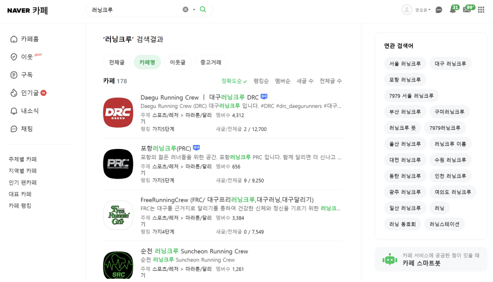

# Crew-In

### 0️⃣ Introduction
#### 소개 
##### [Crew-In! Running Crew 통합 관리 플랫폼]
기존 서비스는 러닝 기록, 크루 정보 제공 기능은 있지만, 크루 운영에 있어서 오픈 채팅방, 인스타그램을 통해 활동 중이고, 크루 관리 또한 이루어지지 않고 있음. 이러한 사용자 불편함에 주목하여 크루 운영, 러닝방 운영, 사용자 소통을 위한 SNS 커뮤니티까지 통합하여 관리할 수 있는 플랫폼을 기획했습니다. 

#### 1) 페르소나
| **인물(1)** | **관리자**        |
|----------|--------------------|
| 이름     | 우 사인             |
| 나이     | 20세 중반           |

| **현재 상황** |
|----------|
| 서울 소재 모 대학의 러닝 동아리 회장을 맡고 있음 |

| **목표** |
|----------|
| 국내 대학교 러닝 동아리 최대 규모를 위해 노력 |

| **고민사항** |                                        |
|--------------|-----------------------------------------|
| **항목**     | **내용**                                 |
| 학업과 동아리 병행 | 학업과 동아리 관리를 동시에 하기 어려움      |
| 단체톡방 관리 | 카카오톡 단체톡방과 학과방이 헷갈리기 시작   |
| 번개런 관리 | 새로운 번개런을 생성할 때마다 카카오톡방이 생성되고 관리하기 어려움 |
| 러닝 일정 관리 | 언제 어디서 어떤 규모의 인원과 러닝을 진행할지 관리가 어려움 |
| 러닝 인원 관리 | 얼마나 신청했고 얼마나 출석했는지 관리가 어려움 |
| 정보 입력 | 매번 수동으로 러닝 정보를 타이핑해서 입력해야 함 |
| 홍보 | 인스타그램으로도 홍보를 해야 함               |
| 참가 횟수 카운팅 | 크루원이 우리 크루 세션에 몇 번 참가했는지 수기로 작성해야 함 |
| 유지 조건 | 크루원 유지 조건 중 학기 8회 참석 조건 있음  |

| **인물** | **사용자**        |
|----------|--------------------|
| 이름     | 긴 밍건             |
| 나이     | 19세                |

| **현재 상황** |
|----------|
| 서울 소재 모 대학 신입생, 지방에서 상경함, 저녁마다 혼자 러닝하는 취미가 있음, I 80%, 새로운 사람들을 만나는 것을 싫어하진 않지만 부끄러움 |

| **목표** | 
|----------|
| 혼자 뛰는 것에서 벗어나서 친구들 혹은 동료들과 뛰고 싶음, 대학교 동아리나 주변지역 크루에 가입하고 싶음 |

| **고민사항** |                                           |
|--------------|------------------------------------------|
| **항목**     | **내용**                                  |
| 친구 부족    | 지방에서 서울에 상경해서 같이 러닝할 친구들이 없음 |
| 러닝 찾기    | 인스타, 오픈톡방 등에서 러닝을 찾을 때 내가 원하는 시간, 거리와 맞는 러닝을 찾기 번거로움 |
| 인스타그램 이용 | 인스타그램을 하지 않아서 동아리 홍보 글이나 관련 글을 찾기가 어려움 |
| 인스타그램 참여 | 인스타그램을 깔았으나, 공식 계정을 팔로우하고 댓글을 다는 과정까지 귀찮고 꺼려짐 |

#### 2) 고객 여정 지도

#### 3) 시장 조사
1. 네이버 카페
- 휴먼 레이스 - 회원수  37000
- 오픈케어 - 회원수 35000
- 대구 러닝크루 - 회원수 12700
- 이외에 회원수 천~백 단위의 러닝크루들  **178여개** 존재함

2. 인스타그램
- SRC Seoul - 팔로워 1.1만
- 88Seoul - 팔로워 1만
- JSRC - 팔로워 7700
- 와우산30 - 팔로워 5116
- 러닝 크루 관련 게시물 약 **585K**

3. 카카오톡 채널
- BTRC 러닝크루 - 748명
- 중앙대 러닝크루 CAUON - 717명
- 춘천 러닝크루 CRC - 501명
- 동탄 러닝 크루 - 455명

#### 4) 차별점 
##### Runnect

1. 기능

- 코스 그리기 (마커를 수동으로 찍으면 이전 마커와 다음 마커의 거리를 계산, 지도를 저장 관리 가능, 마커 최대 20개)
- 외부 SNS나 타 사용자와 공유 가능
- 러닝 기록 아카이빙

2. 장점 

- Google과 Kakao로 3초 회원가입 가능
- 달리기 기능 구현(앱이기 때문에..) 그려놓은 코스를 따라 실시간 위치 기반 정보 전달
- 다른 유저의 코스를 스크랩하여 활용 가능

3. 단점 및 차이점

- 인도를 기준으로 하지 않아서 최단 직선거리로 거리가 계산되는 점. 코스가 길어지고 디테일 해질 경우 최대 마커수에 제한이 걸려 부족함
- 다양한 기능이 없어 보조의 앱으로만 활용 가능. SNS 기능 부재

##### Run Day

1. 기능

- 런데이 크루 내부 추천, 크루 가입 가능
- 러닝 기록 가능
- 챌린지와 이벤트, 외부 마라톤 대회 정보 획득 가능

2. 장점

- 비교적 많은 사용자와 다양한 이벤트를 통해 고객 유치
- 캘린더 형식의 러닝 기록
- 친구, 스트레칭, 근력운동 등 다양한 기능

3. 단점 및 차이점

- 원클릭 가입으로 필터 없이 가입 됨
- 크루에 가입해도 결국 오픈카톡방을 사용하거나 인스타그램에 연결이 됨

##### 카카오톡 오픈 채팅방

1. 기능

- 크루 정보 전달
- 러닝 세션 관리

2. 장점 

- 사용 인원이 가장 많으며 사용자가 친숙함
- 발달된 SNS 기술로 이용자가 접근하기 편함

3. 단점 및 차이점

- 카카오톡과 인스타그램이라는 사생활과 공존함
- SNS를 2개 이상 활용하기 때문에 정보를 수집하기 번거로움
- 여러개의 크루에 가입되어 있다면 관리하기 더 어려워짐
- 누가 크루장인지, 크루원 등등인지 모름

#### 5) 기대효과 
1. **효율적인 커뮤니케이션**
2. **효율적인 크루 관리**
3. **참가자 경험 개선**
4. **커뮤니티 활성화**
5. **러닝 경험 최적화**

### 1️⃣ Jira Sprint 
#### Step1. Sub-PJT I 
1. 프로젝트 주제 정하기 ✅
2. 페르소나 설정, 고객 여정 지도, 시장 조사, 차별점, 기대효과 ✅
3. 실질적인 사용자 조사를 위한 구글폼 생성 및 설문 배포 ✅
4. Jira 설정 및 Gitlab 연결 ✅ 
5. 요구 사항 명세서 작성 ✅
6. Wire Frame 제작 (Figma) ✅
7. ERD 설계 ✅
8. CI/CD 설정 ✅
9. 기타 (개발을 위한 개인 학습 및 기능 구현에 대한 사전 Test) ✅ 

##### [7월8일 - 7월11일] 
| 날짜 | 전체 | 김민경 | 권오윤 | 권윤하 | 박준식 | 박효진 | 이문현 |
| --- | --- | --- | --- | --- | --- | --- | --- |
| 7/08 | 프로젝트 주제 회의, 컨설턴트 코치님 1차 사전 미팅 | Jira 설정 및 Gitlab 연결, 전체 일정 관리 | Jira 설정 및 Gitlab 연결 | 프로젝트 개발 배경 조사, React 컴포넌트 및 초기 프로젝트 구축 학습 | navigator geolocation api 테스트 (gps 정확도 확인) | 아이디어 기획안(페이즈 분류), TypeScript 기본과 타입, 제너릭 | navigator geolocation api 테스트 (gps 정확도 확인) |
| 7/09 | 요구사항 명세서 논의, Git Convention 정의 | Android WebView 테스트, 전체 일정 관리, 와이어프레임 논의, PM 특강, JPA 설정 학습 | Gitlab 재연결, Android WebView 테스트, 와이어프레임 논의, Notion 구조 변경 | 기능 명세서 우선순위 설정, 구글 설문폼 작성, 와이어프레임 논의, React JSX 학습 | navigator geolocation api 테스트, Naver Map api 테스트 (거리 체크 확인) | 기능 명세서 작성, 구글 설문폼 작성, 와이어프레임 논의 및 제작, React + TypeScript + Context API 실습 | navigator geolocation api 테스트 (배포 관리), CI/CD 설정 |
| 7/10 | 와이어 프레임 논의 | 전체 일정 관리, 기술 조사 및 기획 세부사항 정의, DB 기술 스택 논의, 시스템 아키텍쳐 설계, ERD 설계 및 엔티티 개발 학습 | 스프링 JPA 연관 관계 매핑 학습, DB 기술 스택 논의, 시스템 아키텍쳐 설계 | React 속성 및 상태 & 동적 스타일링 학습, 기능 명세서 추가 사항 정리 | pwa, context api + reducer 상태관리 | 구글폼 설문 배포, 기술 조사 및 기획 세부사항 정의, 앱 로고 구상 및 디자인 | Proxy Server 테스트, 시스템 아키텍쳐 설계, CI/CD 설정 |
| 7/11 | 피그마 제작  | ERD 설계, PM 특강, 전체 일정 관리, Figma 컴포넌트 제작  | ERD 설계, 시장 규모 조사 | 고객 여정 지도 구상 및 제작 | 프로젝트 기대효과 작성, FE 프로젝트 폴더 구조 설계 | 앱 차별점 조사 및 정리, 페르소나 및 고객 여정 지도 구상 | 보안 프록시 서버 테스트, api 프록시 서버 배포, gitlab - jenkins webhook 연동 테스트 |

### 2️⃣ 요구사항 명세서 (기능 명세서)

자세히 보기 ▶️ https://www.notion.so/1d8be600aaa54f5080104cabfbdd7322?v=00cbb4178f474a13bb702a53d4b2243c&pvs=4

### 3️⃣ Wire Frame
##### 먼저 간단하게 틀을 잡고 세부적으로 기획 단계를 진행 했습니다.

자세히 보기 ▶️ https://handy-efraasia-07b.notion.site/42b4c4e1f0b04dcb927fb9010ab5b510?pvs=4

### 4️⃣ Figma
##### 전체적으로 잡아둔 틀을 토대로 세부 기획 단계에서 기능 구현 Flow를 자세하게 그렸습니다.

자세히 보기 ▶️ https://www.figma.com/design/cQZvdkCFh2Xw2sSGfp1tWh/Crew-In?node-id=0-1&t=kCKUBpES5vEBQfyv-0 

### 5️⃣ ERD Table

자세히 보기 ▶️ https://www.erdcloud.com/d/9YePRgHpzL3bQN5ym 

### 6️⃣ 설문조사 진행 
##### 사용자층이 보편적이지 않다는 점에 주목하여 사용자 설문조사를 통해 기능 추가 및, 서비스 기획 또한 그려나갔습니다.

자세히 보기 ▶️ https://handy-efraasia-07b.notion.site/c1dd5745d1f04b1f801b80e376aa1d6a?pvs=4   
